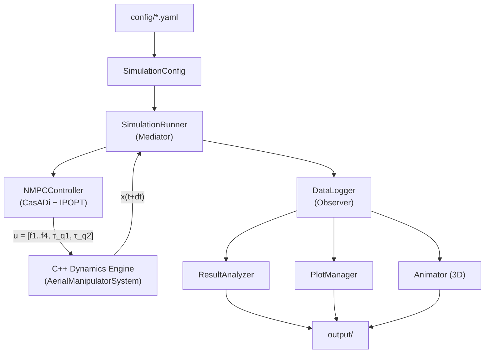

# Aerial Manipulator Simulation — NMPC

**Quadrotor + 2-DOF 3D Manipulator: 비선형 모델 예측 제어(NMPC) 기반 단일 통합 제어**

쿼드로터와 2자유도 3차원 매니퓰레이터의 결합 다물체 동역학 시뮬레이션 프레임워크.
C++ 고속 동역학 엔진과 CasADi 심볼릭 동역학 + IPOPT 솔버를 결합하여,
위치·자세·관절을 **단일 NMPC**로 통합 제어합니다.
기존 계층적 제어(PID + SO(3) + PD)를 완전히 대체하며,
부족구동(underactuated) 시스템의 결합 효과를 NMPC가 자동으로 처리합니다.

---

## Mathematical Background

### 일반화 좌표 및 운동 방정식

시스템의 일반화 좌표는 쿼드로터 6-DOF와 매니퓰레이터 2-DOF로 구성됩니다:

```math
q = \begin{bmatrix} p \in \mathbb{R}^3 \\ \phi \in SO(3) \\ q_1 \\ q_2 \end{bmatrix} \in \mathbb{R}^8
```

결합 운동 방정식 (Coupled Equation of Motion):

```math
M(q)\,\ddot{q} + C(q, \dot{q})\,\dot{q} + G(q) = B\,u
```

여기서:
- $M(q) \in \mathbb{R}^{8 \times 8}$ : 결합 질량 행렬 (coupled mass matrix)
- $C(q, \dot{q})\,\dot{q} \in \mathbb{R}^{8}$ : Coriolis/원심력 벡터
- $G(q) \in \mathbb{R}^{8}$ : 중력 벡터
- $B \in \mathbb{R}^{8 \times 6}$ : 입력 매핑 행렬
- $u = [f_1, f_2, f_3, f_4, \tau_{q_1}, \tau_{q_2}]^T$ : 4개 로터 추력 + 2개 관절 토크

### 상태 벡터

특이점 없는 자세 전파를 위해 quaternion을 사용합니다 (17차원):

```math
x = \begin{bmatrix} p \\ v \\ \mathbf{q} \\ \omega \\ q_j \\ \dot{q}_j \end{bmatrix} = \begin{bmatrix} \text{pos}(3) \\ \text{vel}(3) \\ \text{quat}(4) \\ \text{ang\_vel}(3) \\ \text{joint\_pos}(2) \\ \text{joint\_vel}(2) \end{bmatrix} \in \mathbb{R}^{17}
```

### 좌표계 규약

- **World frame** : NED가 아닌 ENU 기반 ($z$-up)
- **Body frame** : 쿼드로터 질량 중심 기준
- **Quaternion** : $[w, x, y, z]$ 순서 (Hamilton convention)
- **Joint 1 (azimuth)** : body $z$축 기준 회전 (arm의 yaw)
- **Joint 2 (elevation)** : 회전된 $y$축 기준 회전 (arm의 pitch)
- **Home position** : $q_1 = 0, q_2 = 0$ 일 때 arm이 수직 아래 ($-z_{\text{body}}$) 방향

---

## 제어 구조: 단일 통합 NMPC

기존 계층적 제어(Position PID → SO(3) Attitude → Joint PD)를 **단일 NMPC**로 완전히 대체합니다.
위치·자세·관절을 하나의 최적화 문제로 통합하여, 부족구동 결합 효과를 자동으로 처리합니다.


### NMPC 정식화

```math
\min_{U} \sum_{k=0}^{N-1} \|x_k - x_{\text{ref},k}\|^2_Q + \|u_k - u_{\text{ref}}\|^2_R + \text{attitude\_cost}(q_k, q_{\text{ref},k})
```

subject to:

```math
x_{k+1} = f_{\text{RK4}}(x_k, u_k, \Delta t_{\text{mpc}}), \quad u_{\min} \leq u \leq u_{\max}
```

### 핵심 설계 요소

**CasADi 심볼릭 동역학** — C++ 엔진의 운동 방정식을 CasADi 심볼릭 변수로 정확히 재구현합니다 (`control/casadi_dynamics.py`). C++ 엔진과 동일한 $M(q)$, $C(q,\dot{q})$, $G(q)$를 심볼릭으로 구성하여, 시뮬레이션 모델과 예측 모델 사이의 plant-model mismatch가 없습니다.

**Analytic Jacobians via CasADi AD** — CasADi의 자동 미분(AD)으로 동역학의 해석적 Jacobian을 자동 생성합니다. 이를 IPOPT에 전달하여 수렴 속도와 안정성을 크게 향상시킵니다. 수치 미분(finite difference) 대비 정확도와 속도 모두 우월합니다.

**Quaternion 자세 오차 비용** — 자세 오차는 quaternion 곱으로 정의합니다:

```math
q_{\text{err}} = q_{\text{ref}}^{-1} \otimes q
```

비용 함수에서 $q_{\text{err}}$의 허수부(imaginary part) $[q_x, q_y, q_z]$를 페널티로 부과하여,
gimbal lock 없이 전역적으로 유효한 자세 추종을 달성합니다.

**부족구동 자동 처리** — 쿼드로터는 6개 입력(4 로터 + 2 관절)으로 8-DOF를 제어하는 부족구동 시스템입니다. 기존 계층적 제어에서는 "위치 오차 → 원하는 자세 → 자세 제어"로 수동 설계했지만, NMPC는 최적화 과정에서 **"자세를 기울여서 x,y 이동"하는 해를 스스로 탐색**합니다. 별도의 자세 명령 생성 없이 물리 법칙에 기반한 최적 해를 자동으로 찾습니다.

---

## Architecture

하이브리드 C++/Python 아키텍처:

- **C++ Core Engine** : Eigen3 기반 동역학 계산 (질량 행렬, Coriolis, 중력, 수치 적분)
- **pybind11 Bindings** : C++ 엔진을 Python 모듈 `_core`로 노출
- **Python Layer** : NMPC 제어기, 시뮬레이션 오케스트레이션, 분석, 시각화



### Design Patterns

| Pattern | 적용 위치 | 설명 |
|---------|-----------|------|
| **Strategy** | `IntegratorBase` | RK4 / RKF45 적분기 교체 가능 |
| **Mediator** | `SimulationRunner` | 엔진, NMPC, 로거 간 조정 |
| **Observer** | `DataLogger` | 시뮬레이션 데이터 실시간 기록 |
| **Facade** | `SystemWrapper` | C++ 엔진 / Python fallback 통합 인터페이스 |

---

## Simulation Results

### Example 01: Hover Stabilization

정지 비행 평형점에서의 안정성을 검증합니다.

**성능 요약:**

| 지표 | 값 |
|------|-----|
| Position RMSE | $\sim 10^{-24}$ m (기계 정밀도) |
| Joint RMSE | $\sim 10^{-24}$ rad |

**분석:** 호버 평형점에서 $G = Bu$ 가 정확히 성립합니다. NMPC 예측 모델과 C++ 시뮬레이션 모델이 동일한 심볼릭 동역학을 사용하므로, plant-model mismatch 없이 RMSE가 부동소수점 기계 정밀도(machine epsilon) 수준까지 내려갑니다.

---

### Example 02: Circular Trajectory Tracking

x-y 평면에서 원형 경로를 추적하며 NMPC의 동적 추종 성능을 평가합니다.

**파라미터:** $R = 0.3$ m, $\omega = 0.3\pi$ rad/s, altitude $= 1.0$ m


**NMPC 성능 요약:**

| 지표 | NMPC |
|------|------|
| **Total Position RMSE** | **0.347 cm** |

**분석:** NMPC는 예측 구간(prediction horizon) 내에서 미래 궤적을 최적화하므로, 기존 PID의 위상 지연(phase lag) 문제가 근본적으로 해결됩니다. 원형 궤적의 곡률 변화를 미리 예측하여 선제적으로 자세를 기울이는 최적 해를 산출합니다.

---

### Example 03: Arm Motion During Hover

호버링 중 매니퓰레이터를 구동하여 결합 동역학의 핵심 특성을 검증합니다.

**파라미터:**
- Phase 1: $q_2$: $0 \to 45\degree$ (elevation)
- Phase 2: $q_1$: $0 \to 90\degree$ (azimuth)
- Phase 3: 두 관절 원위치 복귀


**NMPC 성능 요약:**

| 지표 | 값 |
|------|-----|
| Position RMSE | 0.38 cm |
| Joint $q_1$ RMSE | 0.65° |
| Max attitude error | 1.18° |

**분석:** NMPC는 매니퓰레이터 구동에 의한 CoM 이동과 반토크를 예측 모델에 포함하여, 위치·자세·관절을 동시에 최적 제어합니다. 기존 계층적 제어에서는 각 루프가 독립적으로 보상했지만, NMPC는 결합 효과를 통합적으로 처리하여 모든 지표에서 크게 개선됩니다.

---

### 성능 비교: NMPC vs 이전 방법

| 지표 | NMPC | SDRE (이전) | PID (이전) |
|------|------|------------|-----------|
| Circle Position RMSE | **0.347 cm** | 0.762 cm | 1.907 cm |
| Arm Position RMSE | **0.38 cm** | 3.36 cm | 8.73 cm |
| Arm Joint $q_1$ RMSE | **0.65°** | 1.19° | 1.39° |

NMPC는 원형 궤적 추적에서 SDRE 대비 54%, PID 대비 82% 개선을 달성합니다.
Arm Motion 위치 RMSE에서는 SDRE 대비 89%, PID 대비 96% 개선을 보여줍니다.

---

## Installation

### Prerequisites

| 항목 | 버전 |
|------|------|
| Python | >= 3.10 |
| CMake | >= 3.16 |
| Eigen3 | >= 3.4 |
| pybind11 | >= 2.11 |
| CasADi | >= 3.6 |
| C++ compiler | C++17 지원 (GCC 9+, MSVC 2019+, Clang 10+) |

### Build Steps

#### 1. Python 의존성 설치

```bash
pip install -r requirements.txt
pip install casadi
```

또는 개발 모드로 설치:

```bash
pip install -e ".[dev]"
```

#### 2. C++ 동역학 엔진 빌드

```bash
# Linux / macOS
bash scripts/build.sh

# 또는 수동 빌드
mkdir build && cd build
cmake .. -DCMAKE_BUILD_TYPE=Release -DPYTHON_EXECUTABLE=$(which python3)
cmake --build . --config Release -j$(nproc)
```

Windows (MSVC):

```powershell
mkdir build; cd build
cmake .. -DCMAKE_BUILD_TYPE=Release
cmake --build . --config Release
```

빌드 결과물인 `_core` 모듈(`.pyd` / `.so`)을 프로젝트 루트 또는 Python path에 배치합니다.

> **Note**: C++ 엔진 없이도 Python layer의 테스트와 CasADi 동역학 검증은 가능하지만, 실제 시뮬레이션 실행에는 C++ 엔진이 필요합니다.

---

## Quick Start

### Example 01: Hover Stabilization

고도 1m에서 정지 비행 안정화 테스트:

```bash
python examples/01_hover.py
```

쿼드로터가 `[0, 0, 1]` m에서 arm을 수직 아래로 내린 상태로 5초간 호버링합니다.

### Example 02: Circular Trajectory Tracking

원형 궤적 추적 (반경 $R = 0.3$ m, 각속도 $\omega = 0.3\pi$ rad/s, 고도 1m):

```bash
python examples/02_position_tracking.py
```

x-y 평면에서 원형 경로를 추적하며 NMPC의 추적 성능을 테스트합니다.

### Example 03: Arm Motion During Hover

호버링 중 매니퓰레이터 구동 -- 결합 동역학 핵심 테스트:

```bash
python examples/03_arm_motion.py
```

3단계 arm sweep을 수행합니다:
1. **Phase 1** (0-3s): elevation $q_2$: $0 \to 45\degree$ (arm이 비스듬히)
2. **Phase 2** (3-6s): azimuth $q_1$: $0 \to 90\degree$ (arm 회전)
3. **Phase 3** (6-9s): 두 관절 모두 원위치 복귀

3D 애니메이션(GIF)도 자동 생성됩니다.

### Output 위치

모든 시뮬레이션 결과는 `output/` 디렉토리에 저장됩니다:

```
output/
  simulations/
    images/      <- 시계열 플롯 (position, attitude, controls, joints, 3D trajectory)
    animations/  <- 3D 애니메이션 (GIF/MP4)
    data/        <- 시뮬레이션 데이터 (HDF5/CSV)
  analysis/
    images/      <- 분석 결과 플롯
    reports/     <- 성능 보고서
  tests/
    images/      <- 테스트 결과 플롯
    reports/     <- 테스트 보고서
```

---

## Configuration

`config/` 디렉토리의 YAML 파일로 모든 파라미터를 관리합니다:

### `nmpc_params.yaml` -- NMPC 파라미터

| 파라미터 | 설명 |
|---------|------|
| `horizon_length` | 예측 구간 길이 $N$ |
| `dt_mpc` | NMPC 이산화 시간 스텝 |
| `Q` | 상태 추종 가중치 행렬 |
| `R` | 제어 입력 가중치 행렬 |
| `attitude_weight` | Quaternion 자세 오차 가중치 |
| `u_min`, `u_max` | 제어 입력 제약 (로터 추력, 관절 토크) |
| `solver_options` | IPOPT 솔버 옵션 (max_iter, tol 등) |

### `default_params.yaml` -- 물리 파라미터

| 섹션 | 주요 파라미터 | 설명 |
|------|-------------|------|
| `quadrotor` | `mass`, `arm_length`, `inertia` | 쿼드로터 질량, 팔 길이, 관성 텐서 |
| `quadrotor` | `thrust_coeff`, `torque_coeff` | 로터 추력/토크 계수 ($k_f$, $k_\tau$) |
| `manipulator.link1/link2` | `mass`, `length`, `com_distance`, `inertia` | 링크 물리 속성 |
| `manipulator` | `attachment_offset` | body frame 내 Joint 1 위치 `[0, 0, -0.1]` m |
| `manipulator.joint_limits` | `q1_min/max`, `q2_min/max` | 관절 한계 (rad) |
| `environment` | `gravity`, `air_density` | 환경 파라미터 |

### `simulation_params.yaml` -- 시뮬레이션 설정

| 파라미터 | 기본값 | 설명 |
|---------|--------|------|
| `duration` | 10.0 s | 총 시뮬레이션 시간 |
| `dt` | 0.001 s | 고정 시간 스텝 |
| `integrator` | `"rk4"` | `"rk4"` 또는 `"rkf45"` (적응형) |
| `adaptive.atol/rtol` | 1e-8 / 1e-6 | RKF45 허용 오차 |
| `initial_conditions` | 호버 상태 | 초기 위치, 자세, 관절 각도 |
| `output.save_format` | `"hdf5"` | `"hdf5"` 또는 `"csv"` |
| `output.image_dpi` | 300 | 플롯 해상도 |
| `output.animation_fps` | 30 | 애니메이션 프레임 레이트 |

---

## Testing

```bash
# 전체 테스트 실행
pytest

# 단위 테스트만 실행
pytest tests/unit/

# 검증 테스트 실행
pytest tests/validation/

# 통합 테스트 실행
pytest tests/integration/

# 커버리지 포함
pytest --cov=. --cov-report=html
```

### 테스트 구성

| 디렉토리 | 테스트 수 | 내용 |
|----------|----------|------|
| `tests/unit/` | 24 | State 래퍼, DataLogger, OutputManager 단위 테스트 |
| `tests/validation/` | 9 | 에너지 보존, 알려진 해 검증 등 물리 검증 테스트 |
| `tests/integration/` | 9 | 결합 동역학, 호버 안정성, 궤적 추적 통합 테스트 |

---

## Project Structure

```
Aerial Manipulator/
├── CMakeLists.txt                  # 최상위 CMake 설정
├── pyproject.toml                  # Python 패키지 설정 (setuptools)
├── requirements.txt                # Python 의존성
├── LICENSE                         # MIT License
│
├── core/                           # C++ 동역학 엔진
│   ├── CMakeLists.txt
│   ├── include/aerial_manipulator/
│   │   ├── types.hpp               #   Eigen 타입, 시스템 차원, 파라미터 구조체
│   │   ├── rigid_body.hpp          #   강체 속성 (질량, 관성)
│   │   ├── quadrotor.hpp           #   쿼드로터 동역학 (추력, 토크, 드래그, mixing matrix)
│   │   ├── manipulator.hpp         #   2-DOF 매니퓰레이터 (기구학, 동역학, Jacobian)
│   │   ├── aerial_manipulator_system.hpp  #   결합 다물체 동역학 (M, C, G, B)
│   │   ├── integrator.hpp          #   적분기 추상 인터페이스 (Strategy)
│   │   ├── rk4_integrator.hpp      #   4차 Runge-Kutta
│   │   └── rkf45_integrator.hpp    #   Runge-Kutta-Fehlberg 4(5) 적응형
│   ├── src/                        #   C++ 구현부
│   │   ├── rigid_body.cpp
│   │   ├── quadrotor.cpp
│   │   ├── manipulator.cpp
│   │   ├── aerial_manipulator_system.cpp
│   │   ├── rk4_integrator.cpp
│   │   └── rkf45_integrator.cpp
│   └── bindings/
│       ├── CMakeLists.txt
│       └── py_aerial_manipulator.cpp  # pybind11 바인딩 (_core 모듈)
│
├── config/                         # YAML 설정 파일
│   ├── default_params.yaml         #   물리 파라미터 (quadrotor, manipulator, environment)
│   ├── nmpc_params.yaml            #   NMPC 파라미터 (horizon, Q, R, 제약, IPOPT 옵션)
│   └── simulation_params.yaml      #   시뮬레이션 설정, 초기 조건, 출력 옵션
│
├── models/                         # Python 모델/데이터 계층
│   ├── state.py                    #   17차원 상태 벡터 래퍼 (named indexing)
│   ├── parameter_manager.py        #   YAML → dataclass 파라미터 변환
│   ├── system_wrapper.py           #   C++ 엔진 Facade (Python fallback 포함)
│   └── output_manager.py           #   출력 경로 관리
│
├── control/                        # NMPC 제어 시스템
│   ├── casadi_dynamics.py          #   CasADi 심볼릭 동역학 (C++ 엔진과 동일한 EOM)
│   └── nmpc_controller.py          #   NMPC 제어기 (CasADi NLP + IPOPT 솔버)
│
├── simulation/                     # 시뮬레이션 오케스트레이션
│   ├── simulation_config.py        #   설정 로드 및 통합
│   ├── simulation_runner.py        #   메인 시뮬레이션 루프 (Mediator)
│   └── time_manager.py             #   시간 관리, 로깅 주기 제어
│
├── analysis/                       # 데이터 분석
│   ├── data_logger.py              #   실시간 데이터 기록 (Observer)
│   └── result_analyzer.py          #   성능 지표 (RMSE, settling time, energy, control effort)
│
├── visualization/                  # 시각화
│   ├── plot_manager.py             #   정적 플롯 (position, attitude, joints, controls, 3D)
│   ├── animator.py                 #   3D 애니메이션 (quadrotor + arm 렌더링)
│   └── plot_styles.py              #   matplotlib 스타일 및 색상 정의
│
├── examples/                       # 실행 예제
│   ├── 01_hover.py                 #   호버 안정화
│   ├── 02_position_tracking.py     #   원형 궤적 추적
│   └── 03_arm_motion.py            #   호버 중 arm 구동 (결합 동역학 테스트)
│
├── tests/                          # 테스트
│   ├── conftest.py                 #   공유 fixtures (파라미터, 호버 상태)
│   ├── unit/                       #   단위 테스트 (24개)
│   │   ├── test_state.py
│   │   ├── test_data_logger.py
│   │   └── test_output_manager.py
│   ├── validation/                 #   물리 검증 테스트 (9개)
│   │   ├── test_energy_conservation.py
│   │   └── test_known_solutions.py
│   └── integration/                #   통합 테스트 (9개)
│       ├── test_coupled_dynamics.py
│       ├── test_hover_stability.py
│       └── test_trajectory_tracking.py
│
├── scripts/
│   └── build.sh                    # C++ 엔진 빌드 스크립트
│
├── docs/
│   ├── images/                     # 문서용 이미지
│   └── animations/                 # 문서용 애니메이션
│
└── output/                         # 시뮬레이션 출력 (gitkeep)
    ├── simulations/
    │   ├── images/
    │   ├── animations/
    │   └── data/
    ├── analysis/
    │   ├── images/
    │   └── reports/
    └── tests/
        ├── images/
        └── reports/
```

---

## References

1. **J. A. E. Andersson, J. Gillis, G. Horn, J. B. Rawlings, M. Diehl**, "CasADi: a software framework for nonlinear optimization and optimal control," *Mathematical Programming Computation*, 11(1), pp. 1-36, 2019.
   - CasADi 심볼릭 프레임워크 및 자동 미분

2. **A. Wachter, L. T. Biegler**, "On the implementation of an interior-point filter line-search algorithm for large-scale nonlinear programming," *Mathematical Programming*, 106(1), pp. 25-57, 2006.
   - IPOPT 내부점법 비선형 최적화 솔버

3. **G. Garimella, M. Kobilarov**, "Towards Model-Predictive Control for Aerial Pick-and-Place," *Proc. IEEE International Conference on Robotics and Automation (ICRA)*, 2015.
   - NMPC 기반 공중 매니퓰레이션 제어

4. **F. Ruggiero, V. Lippiello, A. Ollero**, "Aerial Manipulation: A Literature Review," *IEEE Robotics and Automation Letters*, 2018.
   - 공중 매니퓰레이션 연구 종합 survey

5. **R. Mahony, V. Kumar, P. Corke**, "Multirotor Aerial Vehicles: Modeling, Estimation, and Control of Quadrotor," *IEEE Robotics & Automation Magazine*, 2012.
   - 쿼드로터 동역학 모델링

6. **M. Bodie, M. Brunner, M. Wirth, S. Wahba, J. Allenspach, R. Siegwart, M. Kamel**, "An Omnidirectional Aerial Manipulation Platform for Contact-Based Inspection," *Proc. Robotics: Science and Systems (RSS)*, 2019.
   - NMPC 기반 공중 매니퓰레이터 플랫폼

---

## License

MIT License. See [LICENSE](LICENSE) for details.

Copyright (c) 2026 lsh330
