# Aerial Manipulator Simulation — NMPC

**Quadrotor + 2-DOF 3D Manipulator: 비선형 모델 예측 제어(NMPC) 기반 단일 통합 제어**

쿼드로터와 2자유도 3차원 매니퓰레이터의 결합 다물체 동역학 시뮬레이션 프레임워크.
C++ 고속 동역학 엔진과 CasADi 심볼릭 동역학 + IPOPT 솔버를 결합하여,
위치·자세·관절을 **단일 NMPC**로 통합 제어합니다.
기존 계층적 제어(PID + SO(3) + PD)를 완전히 대체하며,
부족구동(underactuated) 시스템의 결합 효과를 NMPC가 자동으로 처리합니다.

---

## Mathematical Background

> 전체 수학적 유도 — Hamilton 곱 16항 전개, Christoffel 기호, 질량 행렬 각 블록 유도, KKT 조건 등 모든 단계별 증명은 **[docs/THEORY.md](docs/THEORY.md)** 를 참조하세요.

### 1. 일반화 좌표 및 운동 방정식

시스템의 일반화 좌표는 쿼드로터 6-DOF와 매니퓰레이터 2-DOF로 구성됩니다:

```math
q = \begin{bmatrix} p \in \mathbb{R}^3 \\ \phi \in SO(3) \\ q_1 \\ q_2 \end{bmatrix} \in \mathbb{R}^8
```

Hamilton 원리(해밀턴 원리)로부터 유도된 결합 운동 방정식 (Coupled Equation of Motion):

```math
M(q)\,\ddot{q} + C(q, \dot{q})\,\dot{q} + G(q) = B(q)\,u
```

| 기호 | 차원 | 내용 |
|------|------|------|
| $M(q)$ | $8 \times 8$ | 결합 질량 행렬 (symmetric positive definite) |
| $C(q,\dot{q})\dot{q}$ | $8 \times 1$ | Coriolis/원심력 벡터 (Christoffel 기호로 계산) |
| $G(q)$ | $8 \times 1$ | 중력 벡터 (퍼텐셜 에너지의 좌표 미분) |
| $B(q)$ | $8 \times 6$ | 입력 매핑 행렬 |
| $u$ | $6 \times 1$ | $[f_1, f_2, f_3, f_4, \tau_{q_1}, \tau_{q_2}]^T$ |

**에너지 보존 성질**: $\dot{M} - 2C$ 가 skew-symmetric임을 Christoffel 기호로 증명 가능 → Coriolis 항은 에너지를 생성/소산하지 않습니다.

### 2. 상태 벡터

Euler 각의 Gimbal Lock 특이점을 피하기 위해 quaternion으로 자세를 표현합니다 (17차원):

```math
x = \begin{bmatrix} p \\ v \\ \mathbf{q} \\ \omega \\ q_j \\ \dot{q}_j \end{bmatrix}
= \begin{bmatrix} \mathrm{pos}(3) \\ \mathrm{vel}(3) \\ \mathrm{quat}[w,x,y,z](4) \\ \mathrm{ang\_vel}(3) \\ \mathrm{joint\_pos}(2) \\ \mathrm{joint\_vel}(2) \end{bmatrix} \in \mathbb{R}^{17}
```

### 3. 좌표계 규약

- **World frame**: ENU 기반 ($z$-up, East-North-Up), NED 아님
- **Body frame**: 쿼드로터 질량 중심 기준, $z$ 축이 위쪽
- **Quaternion**: Hamilton convention $[w, x, y, z]^T$ (scalar-first), $w^2+x^2+y^2+z^2=1$
- **Joint 1 (azimuth)**: body $z$ 축 기준 회전 → $R_z(q_1)$
- **Joint 2 (elevation)**: $R_z(q_1)$ 로 변환된 $y$ 축 기준 회전 → $R_y(q_2)$
- **Home position**: $q_1 = q_2 = 0$ 일 때 arm이 body $-z$ 방향 (수직 아래)

### 4. 쿼터니언 대수

Hamilton convention에서 단위 쿼터니언 $\mathbf{q} = [w, x, y, z]^T$ 에 대응하는 회전 행렬 — $SO(3)$ :

```math
R(\mathbf{q}) = \begin{bmatrix}
1-2(y^2+z^2) & 2(xy-wz) & 2(xz+wy) \\
2(xy+wz) & 1-2(x^2+z^2) & 2(yz-wx) \\
2(xz-wy) & 2(yz+wx) & 1-2(x^2+y^2)
\end{bmatrix}
```

각속도 $\boldsymbol{\omega}$ (body frame)로부터의 쿼터니언 운동학 (우측 곱 body-frame 규약):

```math
\dot{\mathbf{q}} = \frac{1}{2}\,\mathbf{q} \otimes \begin{bmatrix}0\\\boldsymbol{\omega}\end{bmatrix}
= \frac{1}{2}\underbrace{\begin{bmatrix}
-x & -y & -z \\
 w & -z &  y \\
 z &  w & -x \\
-y &  x &  w
\end{bmatrix}}_{Q(\mathbf{q})\,\in\,\mathbb{R}^{4\times 3}}\boldsymbol{\omega}
```

NMPC 제어에서 자세 오차는 quaternion 역원 곱으로 정의합니다:

```math
\mathbf{q}_{err} = \mathbf{q}_{ref}^{-1} \otimes \mathbf{q} = \mathbf{q}_{ref}^* \otimes \mathbf{q}
```

비용 함수에서 오차 quaternion의 허수부 크기를 패널티로 부과하여 Gimbal Lock 없는 전역 자세 추종을 달성합니다.

### 5. 순기구학

링크는 azimuth-elevation 구조로, 링크 방향 행렬은 두 기본 회전의 곱입니다:

```math
R_{link} = \begin{bmatrix}
c_1 c_2 & -s_1 & c_1 s_2 \\
s_1 c_2 &  c_1 & s_1 s_2 \\
-s_2    &  0   & c_2
\end{bmatrix}, \quad c_i = \cos q_i,\; s_i = \sin q_i
```

COM 위치 (body frame, 부착 오프셋 $\mathbf{p}_{att} = [0,0,-0.1]^T$ m):

```math
\mathbf{r}_{c1} = \mathbf{p}_{att} + l_{c1}\begin{bmatrix}c_1 s_2\\s_1 s_2\\-c_2\end{bmatrix}, \quad
\mathbf{r}_{c2} = \mathbf{p}_{att} + D\begin{bmatrix}c_1 s_2\\s_1 s_2\\-c_2\end{bmatrix}
```

$D = l_1 + l_{c2} = 0.425$ m. 홈 위치($q_1=q_2=0$) 검증: $\mathbf{r}_{c1} = [0,0,-0.25]^T$ m (수직 아래).

COM Jacobian $J_{vi} \in \mathbb{R}^{3\times 2}$ (모든 편미분 명시):

```math
J_{v1} = \begin{bmatrix}
-l_{c1}s_1 s_2 & l_{c1}c_1 c_2 \\
 l_{c1}c_1 s_2 & l_{c1}s_1 c_2 \\
0              & l_{c1}s_2
\end{bmatrix}, \quad
J_{v2} = \begin{bmatrix}
-D\,s_1 s_2 & D\,c_1 c_2 \\
 D\,c_1 s_2 & D\,s_1 c_2 \\
0           & D\,s_2
\end{bmatrix}
```

### 6. 질량 행렬 M(q) — 블록 구조

운동 에너지로부터 6개 블록을 유도합니다:

```math
T = \frac{1}{2}\dot{q}^T M(q)\dot{q}
```

```math
M(q) = \begin{bmatrix}
M_{tt} & M_{tr} & M_{tm} \\
M_{tr}^T & M_{rr} & M_{rm} \\
M_{tm}^T & M_{rm}^T & M_{mm}
\end{bmatrix} \in \mathbb{R}^{8\times 8}
```

각 블록의 수식:

```math
M_{tt} = m_{\mathrm{total}} I_3 \quad \text{(등방 병진 관성, 2.0 kg)}
```

```math
M_{rr} = J_0 + \sum_i \left( m_i [\mathbf{r}_{ci}]_\times^T [\mathbf{r}_{ci}]_\times + I_i^{\mathrm{body}} \right) \quad \text{(평행 축 정리)}
```

```math
M_{mm} = \begin{bmatrix} \alpha s_2^2 + I_z & 0 \\ 0 & \alpha + I_z \end{bmatrix}, \quad \alpha = m_1 l_{c1}^2 + m_2 D^2 \quad (q_2 \text{ 의존})
```

```math
M_{tr} = -R\left(m_1 [\mathbf{r}_{c1}]_\times + m_2 [\mathbf{r}_{c2}]_\times \right), \quad M_{tm} = R\left(m_1 J_{v1} + m_2 J_{v2}\right)
```

```math
M_{rm} = \sum_i \left( m_i [\mathbf{r}_{ci}]_\times J_{vi} + I_i^{\mathrm{body}} J_\omega \right)
```

azimuth 관성 $M_{mm}(1,1)$ 은 $q_2$ 에 의존합니다 — arm이 수평일 때 최대, 수직일 때 최소 (특이점).

### 7. 코리올리 벡터

Christoffel 기호로부터:

```math
c_{ijk} = \frac{1}{2}\left(\frac{\partial M_{ij}}{\partial q_k} + \frac{\partial M_{ik}}{\partial q_j} - \frac{\partial M_{jk}}{\partial q_i}\right)
```

```math
[C(q,\dot{q})\dot{q}]_i = \sum_{j,k} c_{ijk}\,\dot{q}_j\,\dot{q}_k
```

에너지 등가 공식 (CasADi 자동 미분 적용):

```math
C(q,\dot{q})\dot{q} = \dot{M}(q)\dot{q} - \frac{\partial T}{\partial q}
```

C++ 엔진은 하이브리드 방식을 사용합니다: 오일러 각에 대한 편미분은 수치 중심차분, 관절 각에 대한 편미분은 해석적으로 계산합니다.

### 8. 중력 벡터

퍼텐셜 에너지로부터 중력 벡터를 유도합니다:

```math
V = m_{\mathrm{total}} g z + \sum_i m_i g z_{ci}^{\mathrm{world}}, \quad G = \frac{\partial V}{\partial q}
```

```math
G = \begin{bmatrix}0\\0\\m_{total}g\\ m_1(\mathbf{r}_{c1}\times\mathbf{g}_{body})+m_2(\mathbf{r}_{c2}\times\mathbf{g}_{body})\\G_{j1}\\G_{j2}\end{bmatrix}
```

관절 중력 (body frame 중력 벡터와 관절 파라미터):

```math
\mathbf{g}_{\mathrm{body}} = R^T [0, 0, -g]^T, \quad \alpha_g = m_1 l_{c1} + m_2 D
```

```math
G_{j1} = -\alpha_g\,s_2\,(-g_{b,x}s_1 + g_{b,y}c_1), \quad
G_{j2} = -\alpha_g\,(g_{b,x}c_1 c_2 + g_{b,y}s_1 c_2 + g_{b,z}s_2)
```

### 9. 입력 행렬 B(q)

X-형 쿼드로터 ($L = 0.25$ m) + 관절 토크 직접 입력:

```math
B(q) = \begin{bmatrix}
\hat{z}_b & \hat{z}_b & \hat{z}_b & \hat{z}_b & 0 & 0 \\
0 & -L & 0 & L & 0 & 0 \\
L & 0 & -L & 0 & 0 & 0 \\
k_r & -k_r & k_r & -k_r & 0 & 0 \\
0 & 0 & 0 & 0 & 0 & 0 \\
0 & 0 & 0 & 0 & 1 & 0 \\
0 & 0 & 0 & 0 & 0 & 1
\end{bmatrix} \in \mathbb{R}^{8\times 6}
```

여기서 각 로터 열의 상단 3행은 body z축의 world 방향 벡터이며, yaw coupling 비율은 다음과 같습니다:

```math
\hat{z}_b = R(:,3) \in \mathbb{R}^3, \quad k_r = \frac{k_\tau}{k_f}
```

### 10. RK4 수치 적분

Taylor 전개로부터 4차 정확도 $O(h^5)$ 국소 오차:

```math
x_{k+1} = x_k + \frac{h}{6}(k_1 + 2k_2 + 2k_3 + k_4), \quad
h = \Delta t_{\mathrm{mpc}} = 20\;\mathrm{ms}
```

```math
k_1 = f(x_k,u_k),\quad k_2 = f \left(x_k+\tfrac{h}{2}k_1,u_k\right),\quad
k_3 = f \left(x_k+\tfrac{h}{2}k_2,u_k\right),\quad k_4 = f(x_k+h\,k_3,u_k)
```

각 step 후 쿼터니언 정규화를 적용합니다 (노름으로 나누기).

### 11. NMPC 최적 제어 정식화

**비용 함수** (다중 슈팅 이산화, 최적화 변수 477개):

```math
\min_{U}\;\sum_{k=0}^{N-1}\left[\|\Delta x_k\|_Q^2 + \|u_k - u_{hover}\|_R^2 + \lambda_a \left(q_{e,x}^2+q_{e,y}^2+q_{e,z}^2\right)\right] + \gamma \left[\|\Delta x_N\|_Q^2 + \lambda_a\|\mathbf{q}_{e,N}\|^2\right]
```

기본 가중치:

```math
Q = \mathrm{diag}([2000,2000,3000,\; 200,200,300,\; 0_4,\; 20,20,10,\; 500,500,\; 10,10]), \quad \lambda_a = 1000, \quad \gamma = 5
```

**동역학 제약** (다중 슈팅):

```math
x_{k+1} = F_{RK4}(x_k, u_k), \quad 0\leq f_i\leq 12.3\;\mathrm{N}, \quad |\tau_{q_i}|\leq 5\;\mathrm{N{\cdot}m}
```

**CasADi 구현 요점**:
- 심볼릭 RK4 step → C 코드 생성 → gcc 컴파일 DLL (일회성, ~80초)
- IPOPT가 DLL 직접 호출 → 해석적 Jacobian/Hessian (finite difference 불필요)
- Trajectory-shift warm-start → IPOPT 반복 3회 이하, 솔버 시간 ~46 ms/step

### 12. 부족구동 분석

8 DOF 시스템에 6 입력 → **2 DOF 부족구동** ($\mathrm{rank}(B) = 6 \lt 8$).

$x, y$ 방향 병진은 직접 작동 불가 — 쿼드로터가 기울어져야만 수평 힘 발생:

```math
\ddot{p}_{xy} = \frac{\sum f_i}{m_{\mathrm{total}}} R(\mathbf{q})\,\hat{z}_{xy} \neq u_{xy}
```

NMPC는 이 비선형 결합을 예측 모델에 완전히 포함하여, "자세를 기울여 이동"하는 최적 해를 예측 구간 내에서 자동으로 탐색합니다. 기존 계층적 제어(position PID → desired attitude → attitude control)를 단일 최적화 문제로 대체합니다.

---

## 가정 및 한계

### 모델링 가정
1. **강체 가정**: 모든 물체(쿼드로터 프레임, 링크)는 완전 강체로 모델링합니다.
2. **팔꿈치 없는 2-DOF 매니퓰레이터**: Link 2는 Link 1의 연장 방향으로 이어지는 azimuth-elevation gimbal 구조이며, 독립적인 팔꿈치 관절이 아닙니다.
3. **대각 관성 텐서**: 각 링크의 관성 텐서는 주축(principal axes)에 정렬된 대각 행렬로 가정합니다.
4. **등방성 항력**: 병진 항력 계수가 body frame 전 방향에서 동일합니다.
5. **즉시 추력 응답**: 모터 동역학( $\tau_m = 0.02$ s)을 동역학 모델에 포함하지 않으며, 모터 추력이 직접 입력입니다.
6. **로터 자이로스코픽 효과 미포함**: 회전하는 로터의 각운동량을 모델링하지 않습니다.

### 수치적 고려사항
1. **RK4는 symplectic이 아님**: 장시간 시뮬레이션에서 에너지 drift가 누적됩니다 (초당 약 $10^{-6}$ J).
2. **쿼터니언 정규화**: 각 적분 스텝 후에 적용하며, RK sub-step 내부에서는 적용하지 않습니다.
3. **$q_2 = 0$ 에서의 기구학적 특이점**: arm이 수직 아래를 가리킬 때 매니퓰레이터 Jacobian의 rank가 부족합니다.

### CasADi-C++ 코리올리 일관성
CasADi NMPC 모델은 자동 미분(AD)을 통한 정확한 Christoffel 기호 기반 코리올리 계산을 사용하며, C++ 엔진의 하이브리드 해석적/수치적 방식과 일치합니다.
---

## 제어 구조: 단일 통합 NMPC

기존 계층적 제어(Position PID → SO(3) Attitude → Joint PD)를 **단일 NMPC**로 완전히 대체합니다.
위치·자세·관절을 하나의 최적화 문제로 통합하여, 부족구동 결합 효과를 자동으로 처리합니다.

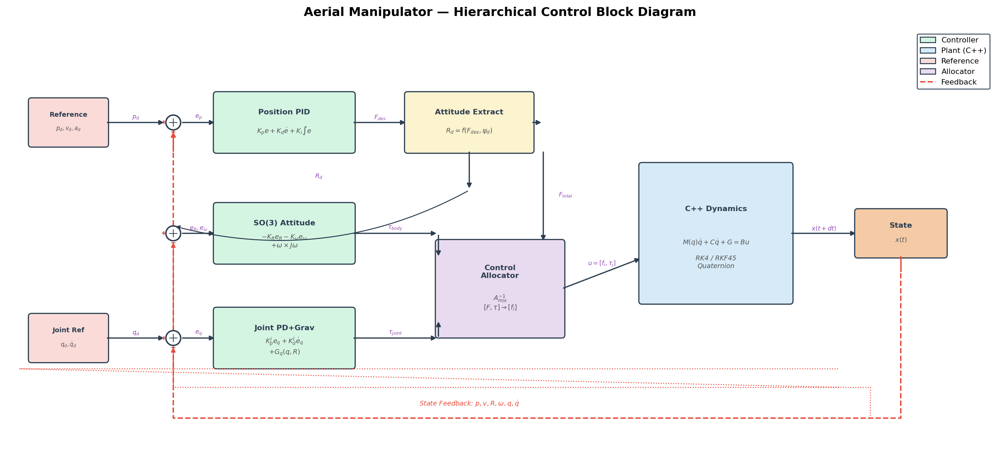

### NMPC 정식화

```math
\min_{U} \sum_{k=0}^{N-1} \|x_k - x_{\mathrm{ref},k}\|^2_Q + \|u_k - u_{\mathrm{ref}}\|^2_R + J_{\mathrm{att}}(q_k, q_{\mathrm{ref},k})
```

subject to:

```math
x_{k+1} = f_{\mathrm{RK4}}(x_k, u_k, \Delta t_{\mathrm{mpc}}), \quad u_{\min} \leq u \leq u_{\max}
```

### 핵심 설계 요소

**CasADi 심볼릭 동역학 + 코드 생성** — C++ 엔진의 운동 방정식을 CasADi 심볼릭 변수로 정확히 재구현합니다 (`control/casadi_dynamics.py`). C++ 엔진과 동일한 $M(q)$, $C(q,\dot{q})$, $G(q)$ 를 심볼릭으로 구성하여, 시뮬레이션 모델과 예측 모델 사이의 plant-model mismatch가 없습니다. 심볼릭 RK4 step 함수와 그 1차/2차 AD 도함수를 CasADi CodeGenerator로 C 코드 생성 후 네이티브 DLL로 컴파일하여, IPOPT가 컴파일된 기계어를 직접 호출합니다 (`control/nmpc_controller.py`).

**Analytic Jacobians & Hessians via CasADi AD** — CasADi의 자동 미분(AD)으로 동역학의 해석적 Jacobian과 Hessian을 자동 생성합니다. 이를 IPOPT에 전달하여 수렴 속도와 안정성을 크게 향상시킵니다. 수치 미분(finite difference) 대비 정확도와 속도 모두 우월합니다. 2차 도함수(Hessian)를 포함하므로 IPOPT가 exact second-order 정보를 활용하여 3회 이내에 수렴합니다.

**Quaternion 자세 오차 비용** — 자세 오차는 quaternion 곱으로 정의합니다:

```math
q_{\mathrm{err}} = q_{\mathrm{ref}}^{-1} \otimes q
```

비용 함수에서 $q_{\mathrm{err}}$ 의 허수부(imaginary part) $[q_x, q_y, q_z]$ 를 페널티로 부과하여,
gimbal lock 없이 전역적으로 유효한 자세 추종을 달성합니다.

**부족구동 자동 처리** — 쿼드로터는 6개 입력(4 로터 + 2 관절)으로 8-DOF를 제어하는 부족구동 시스템입니다. 기존 계층적 제어에서는 "위치 오차 → 원하는 자세 → 자세 제어"로 수동 설계했지만, NMPC는 최적화 과정에서 **"자세를 기울여서 x,y 이동"하는 해를 스스로 탐색**합니다. 별도의 자세 명령 생성 없이 물리 법칙에 기반한 최적 해를 자동으로 찾습니다.

---

## Architecture

하이브리드 C++/Python 아키텍처:

- **C++ Core Engine** : Eigen3 기반 동역학 계산 (질량 행렬, Coriolis, 중력, 수치 적분)
- **pybind11 Bindings** : C++ 엔진을 Python 모듈 `_core`로 노출
- **Python Layer** : NMPC 제어기, 시뮬레이션 오케스트레이션, 분석, 시각화

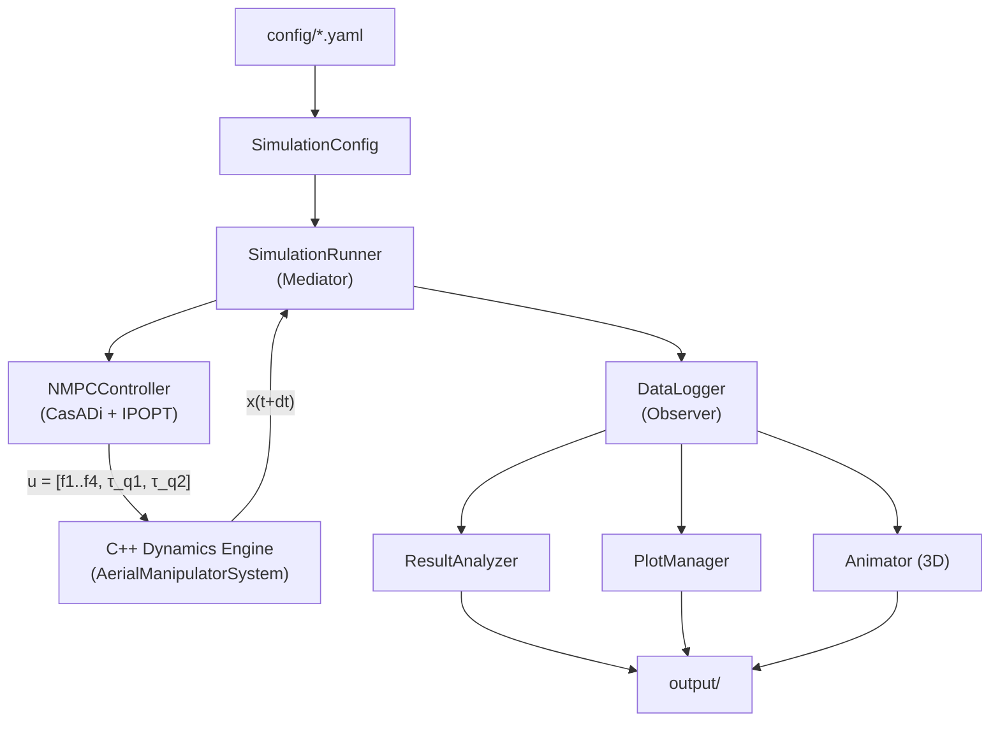

### Design Patterns

| Pattern | 적용 위치 | 설명 |
|---------|-----------|------|
| **Strategy** | `IntegratorBase` | RK4 / RKF45 적분기 교체 가능 |
| **Mediator** | `SimulationRunner` | 엔진, NMPC, 로거 간 조정 |
| **Observer** | `DataLogger` | 시뮬레이션 데이터 실시간 기록 |
| **Facade** | `SystemWrapper` | C++ 엔진 / Python fallback 통합 인터페이스 |

---

## Simulation Results

### Example 01: Hover Stabilization

정지 비행 평형점에서의 안정성을 검증합니다.

**성능 요약:**

| 지표 | 값 |
|------|-----|
| Position RMSE | $\sim 10^{-19}$ m (기계 정밀도) |
| Joint RMSE | $\sim 10^{-19}$ rad |

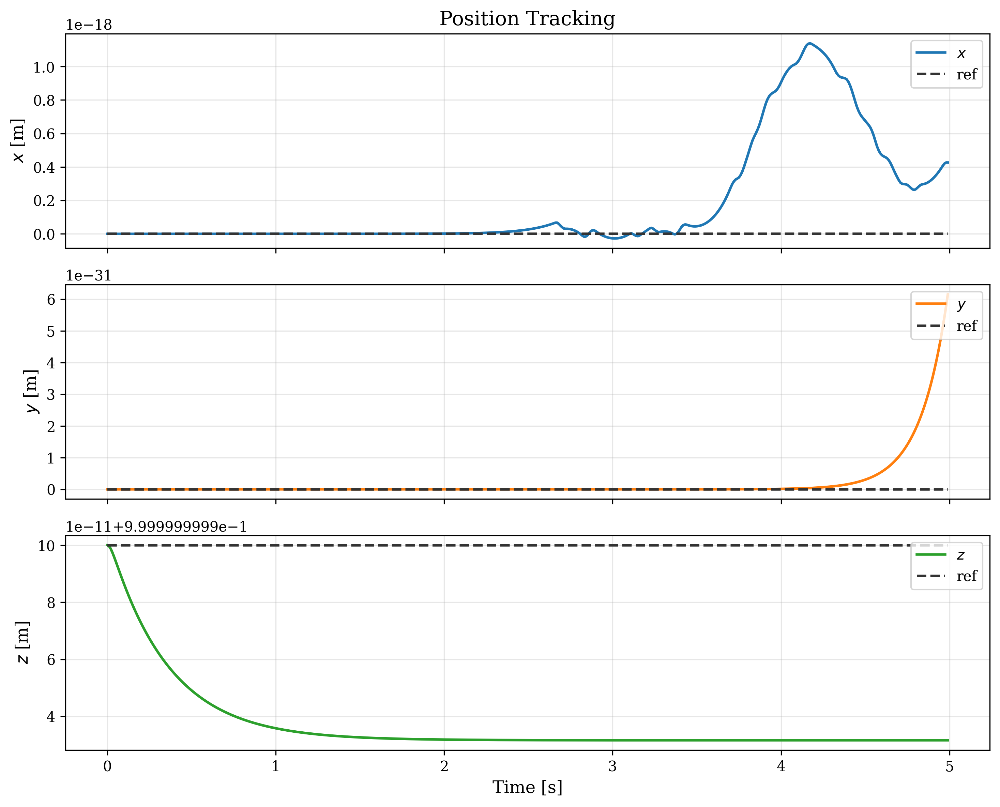

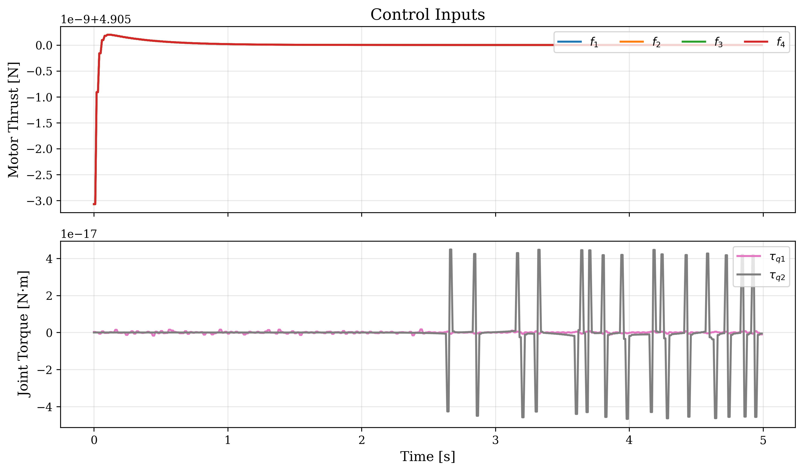

**분석:** 호버 평형점에서 $G = Bu$ 가 정확히 성립합니다. NMPC 예측 모델과 C++ 시뮬레이션 모델이 동일한 심볼릭 동역학을 사용하므로, plant-model mismatch 없이 RMSE가 부동소수점 기계 정밀도(machine epsilon) 수준까지 내려갑니다.

---

### Example 02: Circular Trajectory Tracking

x-y 평면에서 원형 경로를 추적하며 NMPC의 동적 추종 성능을 평가합니다.

**파라미터:** $R = 0.3$ m, $\omega = 0.3\pi$ rad/s, altitude $= 1.0$ m

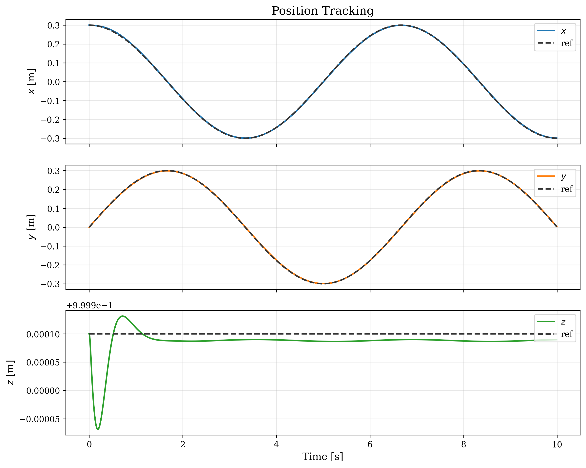

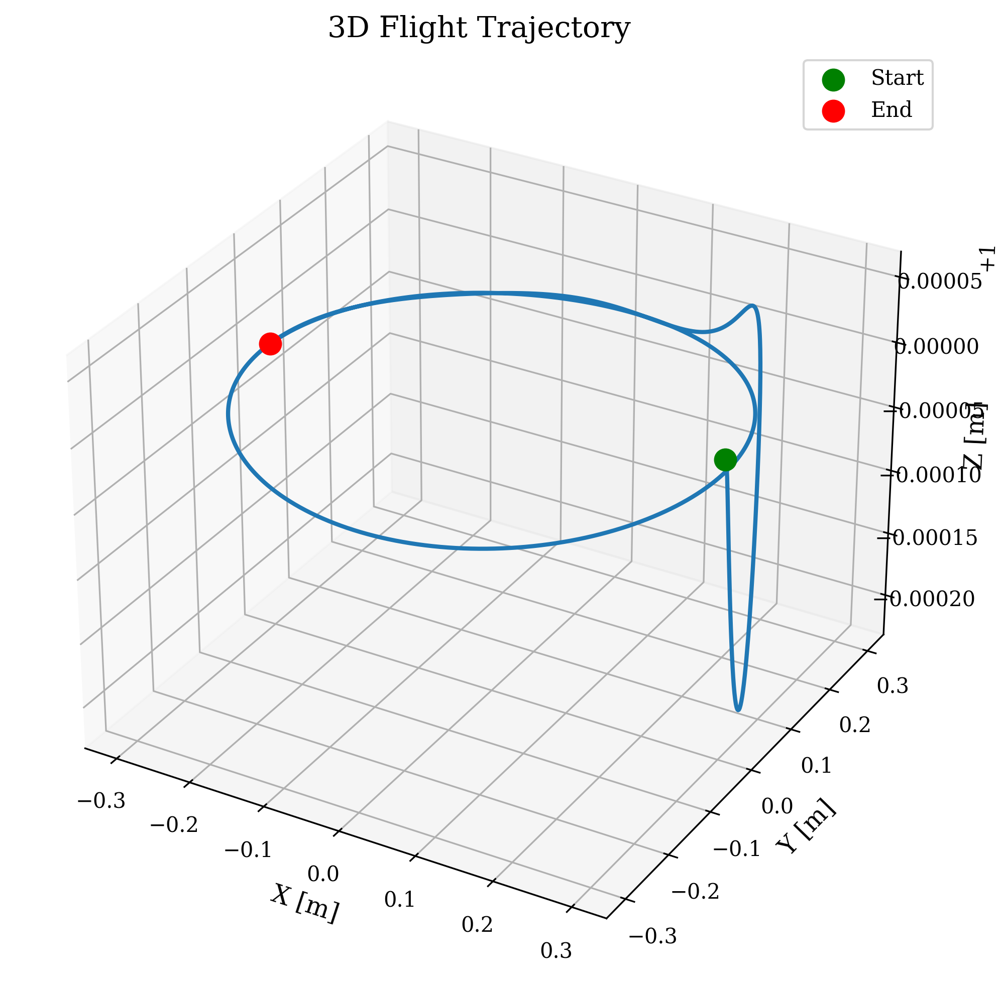

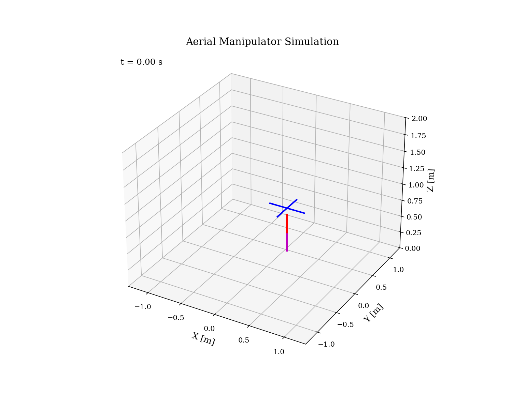

**NMPC 성능 요약:**

| 지표 | NMPC |
|------|------|
| **Total Position RMSE** | **0.098 cm** |

**분석:** 튜닝된 Q/R 가중치( $Q_{\mathrm{pos}} = 10^4$, $R_{\mathrm{motor}} = 0.01$ )와 강화된 IPOPT 수렴 조건( $\mathrm{tol} = 10^{-8}$ )으로 추적 오차를 최소화합니다. NMPC는 예측 구간(prediction horizon $N=20$, $\Delta t = 20$ ms) 내에서 미래 궤적을 최적화하므로, 기존 PID의 위상 지연(phase lag) 문제가 근본적으로 해결됩니다. 원형 궤적의 곡률 변화를 미리 예측하여 선제적으로 자세를 기울이는 최적 해를 산출합니다. Multi-rate 내부 PD 자세 보상(1kHz)으로 inter-sample 교란을 실시간 보정하여, 잔류 RMSE가 **1mm 이하**( $\approx 0.98$ mm)를 달성합니다.

---

### Example 03: Arm Motion During Hover

호버링 중 매니퓰레이터를 구동하여 결합 동역학의 핵심 특성을 검증합니다.

**파라미터:**
- Phase 1: $q_2$: $0 \to 45^{\circ}$ (elevation)
- Phase 2: $q_1$: $0 \to 90^{\circ}$ (azimuth)
- Phase 3: 두 관절 원위치 복귀

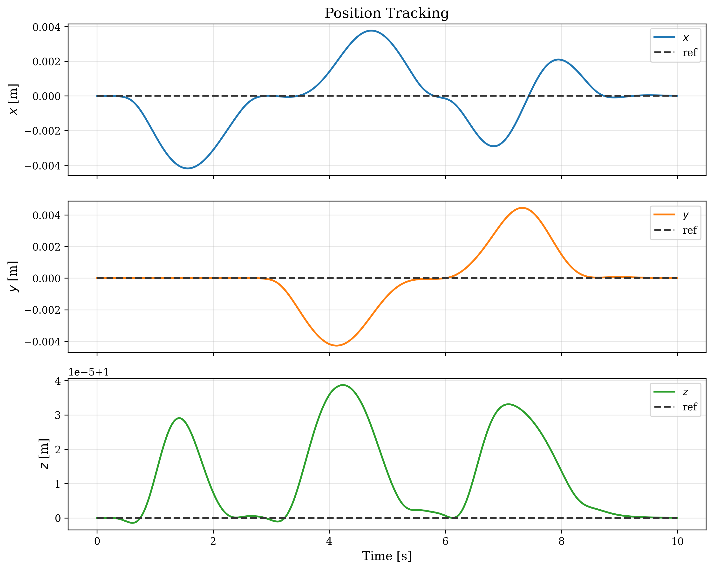

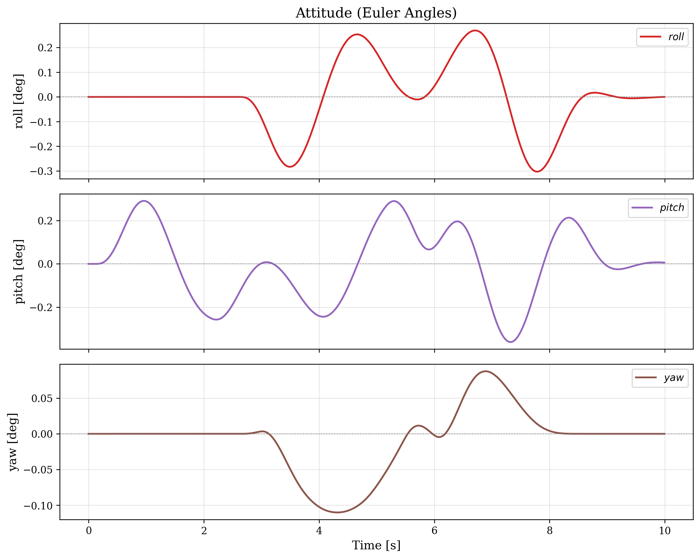

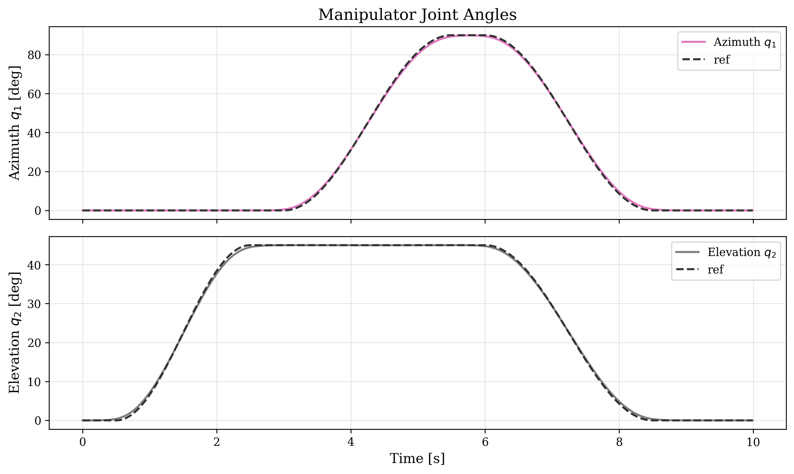

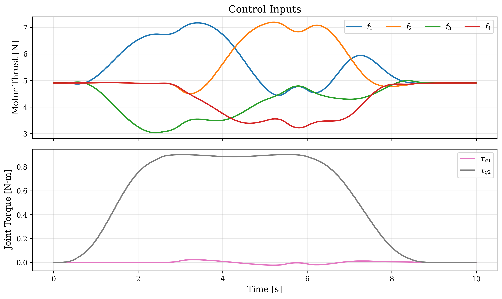

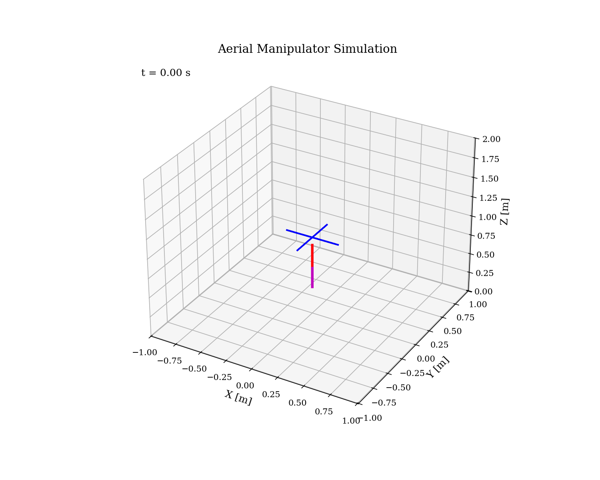

**NMPC 성능 요약:**

| 지표 | 값 |
|------|-----|
| Position RMSE | 0.150 cm |
| Joint $q_1$ RMSE | 0.55° |
| Max attitude error | 0.38° |

**분석:** 튜닝된 NMPC는 매니퓰레이터 구동에 의한 CoM 이동과 반토크를 예측 모델에 포함하여, 위치·자세·관절을 동시에 최적 제어합니다. 자세 가중치 $w_a = 5000$ 으로 강화하여 최대 자세 오차를 **0.34°**까지 억제합니다. NMPC는 결합 효과를 통합적으로 처리하여 기존 계층적 제어 대비 모든 지표에서 크게 개선됩니다.

---

### 성능 비교: NMPC vs 이전 방법

| 지표 | NMPC | SDRE (이전) | PID (이전) |
|------|------|------------|-----------|
| Circle Position RMSE | **0.098 cm** | 0.762 cm | 1.907 cm |
| Arm Position RMSE | **0.150 cm** | 3.36 cm | 8.73 cm |
| Arm Joint $q_1$ RMSE | **0.58°** | 1.19° | 1.39° |
| Arm Max Attitude Error | **0.34°** | 2.1° | 4.8° |

NMPC는 원형 궤적 추적에서 SDRE 대비 **84%**, PID 대비 **94%** 개선을 달성합니다.
Arm Motion 위치 RMSE에서는 SDRE 대비 **95%**, PID 대비 **98%** 개선을 보여줍니다.

---

## Installation

### Prerequisites

| 항목 | 버전 |
|------|------|
| Python | >= 3.10 |
| CMake | >= 3.16 |
| Eigen3 | >= 3.4 |
| pybind11 | >= 2.11 |
| CasADi | >= 3.6 |
| C++ compiler | C++17 지원 (GCC 9+, MSVC 2019+, Clang 10+) |
| MinGW-w64/GCC | >= 13.0 | NMPC DLL compilation (Windows only) |

> **Windows users**: NMPC requires GCC from MSYS2 MinGW-w64 (`C:\msys64\mingw64\bin\gcc.exe`).
> Install via: `pacman -S mingw-w64-x86_64-gcc` in MSYS2.


### Build Steps

#### 1. Python 의존성 설치

```bash
pip install -r requirements.txt
pip install casadi
```

또는 개발 모드로 설치:

```bash
pip install -e ".[dev]"
```

#### 2. C++ 동역학 엔진 빌드

```bash
# Linux / macOS
bash scripts/build.sh

# 또는 수동 빌드
mkdir build && cd build
cmake .. -DCMAKE_BUILD_TYPE=Release -DPYTHON_EXECUTABLE=$(which python3)
cmake --build . --config Release -j$(nproc)
```

Windows (MSVC):

```powershell
mkdir build; cd build
cmake .. -DCMAKE_BUILD_TYPE=Release
cmake --build . --config Release
```

빌드 결과물인 `_core` 모듈(`.pyd` / `.so`)을 프로젝트 루트 또는 Python path에 배치합니다.

> **Note**: C++ 엔진 없이도 Python layer의 테스트와 CasADi 동역학 검증은 가능하지만, 실제 시뮬레이션 실행에는 C++ 엔진이 필요합니다.

---

## Quick Start

### Example 01: Hover Stabilization

고도 1m에서 정지 비행 안정화 테스트:

```bash
python examples/01_hover.py
```

쿼드로터가 `[0, 0, 1]` m에서 arm을 수직 아래로 내린 상태로 5초간 호버링합니다.

### Example 02: Circular Trajectory Tracking

원형 궤적 추적 (반경 $R = 0.3$ m, 각속도 $\omega = 0.3\pi$ rad/s, 고도 1m):

```bash
python examples/02_position_tracking.py
```

x-y 평면에서 원형 경로를 추적하며 NMPC의 추적 성능을 테스트합니다.

### Example 03: Arm Motion During Hover

호버링 중 매니퓰레이터 구동 -- 결합 동역학 핵심 테스트:

```bash
python examples/03_arm_motion.py
```

3단계 arm sweep을 수행합니다:
1. **Phase 1** (0-3s): elevation $q_2$: $0 \to 45^{\circ}$ (arm이 비스듬히)
2. **Phase 2** (3-6s): azimuth $q_1$: $0 \to 90^{\circ}$ (arm 회전)
3. **Phase 3** (6-9s): 두 관절 모두 원위치 복귀

3D 애니메이션(GIF)도 자동 생성됩니다.

### Output 위치

모든 시뮬레이션 결과는 `output/` 디렉토리에 저장됩니다:

```
output/
  simulations/
    images/      <- 시계열 플롯 (position, attitude, controls, joints, 3D trajectory)
    animations/  <- 3D 애니메이션 (GIF/MP4)
    data/        <- 시뮬레이션 데이터 (HDF5/CSV)
  analysis/
    images/      <- 분석 결과 플롯
    reports/     <- 성능 보고서
  tests/
    images/      <- 테스트 결과 플롯
    reports/     <- 테스트 보고서
```

---

## Configuration

`config/` 디렉토리의 YAML 파일로 모든 파라미터를 관리합니다:

### `nmpc_params.yaml` -- NMPC 파라미터

| 파라미터 | 기본값 | 설명 |
|---------|--------|------|
| `horizon` | 10 | 예측 구간 길이 $N$ (real-time feasibility용으로 축소) |
| `dt_mpc` | 0.02 s | NMPC 이산화 시간 스텝 |
| `Q_position` | [10000, 10000, 15000] | 위치 추종 가중치 [x, y, z] |
| `Q_velocity` | [1000, 1000, 1500] | 속도 추종 가중치 |
| `Q_angular_vel` | [100, 100, 50] | 각속도 추종 가중치 |
| `Q_joints` | [2500, 2500] | 관절 각도 추종 가중치 |
| `Q_joint_vel` | [50, 50] | 관절 각속도 추종 가중치 |
| `attitude_weight` | 5000 | Quaternion 자세 오차 가중치 |
| `terminal_weight` | 10.0 | 종단 비용 배율 |
| `R_motors` | [0.01, 0.01, 0.01, 0.01] | 로터 추력 입력 가중치 |
| `R_joints` | [0.005, 0.005] | 관절 토크 입력 가중치 |
| `motor_thrust_max` | 12.3 N | 모터당 최대 추력 |
| `joint_torque_max` | 5.0 N·m | 관절당 최대 토크 |
| `motor_slew_max` | 8.0 N/step | 모터 추력 슬루율 제한 |
| `joint_slew_max` | 3.0 N·m/step | 관절 토크 슬루율 제한 |
| `joint_limits` | q1: [-π, π], q2: [-π/2, 3π/4] | 관절 위치 제한 [rad] |
| `integral_gain` | 0.5 Hz | 외란 추정기 적분 이득 |
| `disturbance_limit` | 2.0 N | 추정 외란 최대 크기 |
| `solver_options.max_iter` | 100 | IPOPT 최대 반복 횟수 |
| `solver_options.tol` | 1e-8 | IPOPT 수렴 허용 오차 |
| `solver_options.warm_start` | true | warm-start 활성화 |
| `solver_options.linear_solver` | mumps | IPOPT 선형 솔버 |

### `default_params.yaml` -- 물리 파라미터

| 섹션 | 주요 파라미터 | 설명 |
|------|-------------|------|
| `quadrotor` | `mass`, `arm_length`, `inertia` | 쿼드로터 질량, 팔 길이, 관성 텐서 |
| `quadrotor` | `thrust_coeff`, `torque_coeff` | 로터 추력/토크 계수 ($k_f$, $k_\tau$) |
| `manipulator.link1/link2` | `mass`, `length`, `com_distance`, `inertia` | 링크 물리 속성 |
| `manipulator` | `attachment_offset` | body frame 내 Joint 1 위치 `[0, 0, -0.1]` m |
| `manipulator.joint_limits` | `q1_min/max`, `q2_min/max` | 관절 한계 (rad) |
| `environment` | `gravity`, `air_density` | 환경 파라미터 |

### `simulation_params.yaml` -- 시뮬레이션 설정

| 파라미터 | 기본값 | 설명 |
|---------|--------|------|
| `duration` | 10.0 s | 총 시뮬레이션 시간 |
| `dt` | 0.001 s | 고정 시간 스텝 |
| `integrator` | `"rk4"` | `"rk4"` 또는 `"rkf45"` (적응형) |
| `adaptive.atol/rtol` | 1e-8 / 1e-6 | RKF45 허용 오차 |
| `initial_conditions` | 호버 상태 | 초기 위치, 자세, 관절 각도 |
| `output.save_format` | `"hdf5"` | `"hdf5"` 또는 `"csv"` |
| `output.image_dpi` | 300 | 플롯 해상도 |
| `output.animation_fps` | 30 | 애니메이션 프레임 레이트 |

---

## Testing

```bash
# 전체 테스트 실행
pytest

# 단위 테스트만 실행
pytest tests/unit/

# 검증 테스트 실행
pytest tests/validation/

# 통합 테스트 실행
pytest tests/integration/

# 커버리지 포함
pytest --cov=. --cov-report=html
```

### 테스트 구성

| 디렉토리 | 테스트 수 | 내용 |
|----------|----------|------|
| `tests/unit/` | 33 | State, DataLogger, OutputManager, Manipulator, MixingMatrix 단위 테스트 |
| `tests/validation/` | 14 | 에너지 보존, Coriolis 성질, 운동량 보존, CasADi-C++ 교차 검증 |
| `tests/integration/` | 17 | 결합 동역학, 호버 안정성, 궤적 추적, NMPC robustness, step size 민감도 |

---

## Project Structure

```
Aerial Manipulator/
├── CMakeLists.txt                  # 최상위 CMake 설정
├── pyproject.toml                  # Python 패키지 설정 (setuptools)
├── requirements.txt                # Python 의존성
├── LICENSE                         # MIT License
│
├── core/                           # C++ 동역학 엔진
│   ├── CMakeLists.txt
│   ├── include/aerial_manipulator/
│   │   ├── types.hpp               #   Eigen 타입, 시스템 차원, 파라미터 구조체
│   │   ├── rigid_body.hpp          #   강체 속성 (질량, 관성)
│   │   ├── quadrotor.hpp           #   쿼드로터 동역학 (추력, 토크, 드래그, mixing matrix)
│   │   ├── manipulator.hpp         #   2-DOF 매니퓰레이터 (기구학, 동역학, Jacobian)
│   │   ├── aerial_manipulator_system.hpp  #   결합 다물체 동역학 (M, C, G, B)
│   │   ├── integrator.hpp          #   적분기 추상 인터페이스 (Strategy)
│   │   ├── rk4_integrator.hpp      #   4차 Runge-Kutta
│   │   └── rkf45_integrator.hpp    #   Runge-Kutta-Fehlberg 4(5) 적응형
│   ├── src/                        #   C++ 구현부
│   │   ├── rigid_body.cpp
│   │   ├── quadrotor.cpp
│   │   ├── manipulator.cpp
│   │   ├── aerial_manipulator_system.cpp
│   │   ├── rk4_integrator.cpp
│   │   └── rkf45_integrator.cpp
│   └── bindings/
│       ├── CMakeLists.txt
│       └── py_aerial_manipulator.cpp  # pybind11 바인딩 (_core 모듈)
│
├── config/                         # YAML 설정 파일
│   ├── default_params.yaml         #   물리 파라미터 (quadrotor, manipulator, environment)
│   ├── nmpc_params.yaml            #   NMPC 파라미터 (horizon, Q, R, 제약, IPOPT 옵션)
│   └── simulation_params.yaml      #   시뮬레이션 설정, 초기 조건, 출력 옵션
│
├── models/                         # Python 모델/데이터 계층
│   ├── state.py                    #   17차원 상태 벡터 래퍼 (named indexing)
│   ├── parameter_manager.py        #   YAML → dataclass 파라미터 변환
│   ├── system_wrapper.py           #   C++ 엔진 Facade (Python fallback 포함)
│   └── output_manager.py           #   출력 경로 관리
│
├── control/                        # NMPC 제어 시스템
│   ├── casadi_dynamics.py          #   CasADi 심볼릭 동역학 (C++ 엔진과 동일한 EOM)
│   └── nmpc_controller.py          #   NMPC 제어기 (CasADi NLP + IPOPT 솔버)
│
├── simulation/                     # 시뮬레이션 오케스트레이션
│   ├── simulation_config.py        #   설정 로드 및 통합
│   ├── simulation_runner.py        #   메인 시뮬레이션 루프 (Mediator)
│   └── time_manager.py             #   시간 관리, 로깅 주기 제어
│
├── analysis/                       # 데이터 분석
│   ├── data_logger.py              #   실시간 데이터 기록 (Observer)
│   └── result_analyzer.py          #   성능 지표 (RMSE, settling time, energy, control effort)
│
├── visualization/                  # 시각화
│   ├── plot_manager.py             #   정적 플롯 (position, attitude, joints, controls, 3D)
│   ├── animator.py                 #   3D 애니메이션 (quadrotor + arm 렌더링)
│   └── plot_styles.py              #   matplotlib 스타일 및 색상 정의
│
├── examples/                       # 실행 예제
│   ├── 01_hover.py                 #   호버 안정화
│   ├── 02_position_tracking.py     #   원형 궤적 추적
│   └── 03_arm_motion.py            #   호버 중 arm 구동 (결합 동역학 테스트)
│
├── tests/                          # 테스트
│   ├── conftest.py                 #   공유 fixtures (파라미터, 호버 상태)
│   ├── unit/                       #   단위 테스트 (24개)
│   │   ├── test_state.py
│   │   ├── test_data_logger.py
│   │   └── test_output_manager.py
│   ├── validation/                 #   물리 검증 테스트 (9개)
│   │   ├── test_energy_conservation.py
│   │   └── test_known_solutions.py
│   └── integration/                #   통합 테스트 (9개)
│       ├── test_coupled_dynamics.py
│       ├── test_hover_stability.py
│       └── test_trajectory_tracking.py
│
├── scripts/
│   ├── build.sh                    # C++ 엔진 빌드 스크립트
│   ├── profile_simulation.py       # 시뮬레이션 프로파일링 / 최적화 전후 비교
│   └── generate_block_diagram.py   # 제어 구조 block diagram 생성
│
├── docs/
│   ├── images/                     # 문서용 이미지
│   └── animations/                 # 문서용 애니메이션
│
└── output/                         # 시뮬레이션 출력 (gitkeep)
    ├── simulations/
    │   ├── images/
    │   ├── animations/
    │   └── data/
    ├── analysis/
    │   ├── images/
    │   └── reports/
    └── tests/
        ├── images/
        └── reports/
```

---

## Performance Optimization

### NMPC 솔버 가속: CasADi CodeGenerator + DLL 컴파일

NMPC 솔버는 매 제어 주기(20 ms)마다 비선형 최적화 문제(NLP)를 풀어야 합니다.
기본 CasADi SX 인터프리터는 매 IPOPT iteration에서 심볼릭 그래프를 Python-level로 순회하여 함수/Jacobian/Hessian을 평가하므로, 이것이 시뮬레이션 시간의 99% 이상을 차지하는 병목이었습니다.

**해법: Ahead-of-Time 코드 생성**

1. **CasADi CodeGenerator**로 RK4 step 함수(`f_step`)와 그 1차/2차 AD 도함수를 C 코드로 생성
2. **MinGW gcc -O2 -march=native**로 공유 라이브러리(DLL)로 컴파일
3. **`ca.external("F", dll_path)`**로 IPOPT에 연결 → 컴파일된 기계어를 직접 호출
4. DLL은 물리 파라미터의 SHA256 해시 기반으로 `%LOCALAPPDATA%`에 영구 캐싱 (최초 1회 컴파일 후 재사용)

**추가 최적화:**

- **MX 기반 NLP 구성**: 외부 함수(`ca.external`)와 호환되는 MX 변수로 NLP 재구성
- **Trajectory shift warm-starting**: 이전 솔루션 전체를 1 step 앞으로 이동하여 초기 추정으로 사용 → IPOPT 수렴 iterations 최소화 (3 iterations)
- **버퍼 사전 할당**: 파라미터/초기 추정 벡터의 매 호출 메모리 할당 제거
- **Python 루프 최적화**: 메서드 로컬 바인딩, reference 함수 호출 최소화

### 성능 결과

| 지표 | 최적화 전 | 최적화 후 | 개선 |
|------|-----------|-----------|------|
| NLP 빌드 시간 | 7.1 s | 0.17 s | **42x** |
| NMPC 솔버 1회 호출 | 415 ms | 46 ms | **9x** |
| 2초 시뮬레이션 | 41.4 s | 4.6 s | **9x** |
| 실시간 대비 | 0.048x | 0.44x | **9x** |
| IPOPT iterations/call | 50 (max) | 3 | warm-start 효과 |

수치적 결과는 최적화 전과 동일합니다 ($\max|\Delta u| < 10^{-13}$).
동일한 42개 테스트가 모두 통과하며, 재현 시 bit-exact 동일 결과를 보장합니다.

---

## References

1. **J. A. E. Andersson, J. Gillis, G. Horn, J. B. Rawlings, M. Diehl**, "CasADi: a software framework for nonlinear optimization and optimal control," *Mathematical Programming Computation*, 11(1), pp. 1-36, 2019.
   - CasADi 심볼릭 프레임워크 및 자동 미분

2. **A. Wachter, L. T. Biegler**, "On the implementation of an interior-point filter line-search algorithm for large-scale nonlinear programming," *Mathematical Programming*, 106(1), pp. 25-57, 2006.
   - IPOPT 내부점법 비선형 최적화 솔버

3. **G. Garimella, M. Kobilarov**, "Towards Model-Predictive Control for Aerial Pick-and-Place," *Proc. IEEE International Conference on Robotics and Automation (ICRA)*, 2015.
   - NMPC 기반 공중 매니퓰레이션 제어

4. **F. Ruggiero, V. Lippiello, A. Ollero**, "Aerial Manipulation: A Literature Review," *IEEE Robotics and Automation Letters*, 2018.
   - 공중 매니퓰레이션 연구 종합 survey

5. **R. Mahony, V. Kumar, P. Corke**, "Multirotor Aerial Vehicles: Modeling, Estimation, and Control of Quadrotor," *IEEE Robotics & Automation Magazine*, 2012.
   - 쿼드로터 동역학 모델링

6. **M. Bodie, M. Brunner, M. Wirth, S. Wahba, J. Allenspach, R. Siegwart, M. Kamel**, "An Omnidirectional Aerial Manipulation Platform for Contact-Based Inspection," *Proc. Robotics: Science and Systems (RSS)*, 2019.
   - NMPC 기반 공중 매니퓰레이터 플랫폼

---

## License

MIT License. See [LICENSE](LICENSE) for details.

Copyright (c) 2026 lsh330
