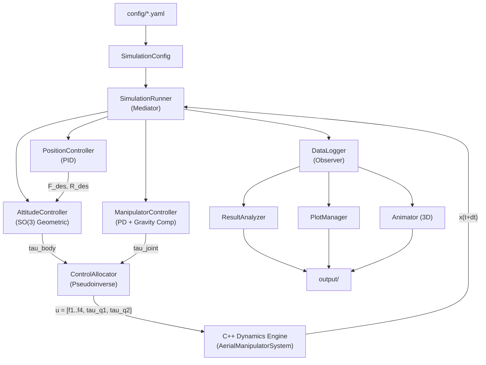

# Aerial Manipulator Simulation

**Quadrotor + 2-DOF 3D Manipulator Coupled Dynamics Simulation**

쿼드로터와 2자유도 3차원 매니퓰레이터의 결합 다물체 동역학 시뮬레이션 프레임워크.
C++ 고속 동역학 엔진과 Python 제어/분석 파이프라인을 결합한 하이브리드 아키텍처로,
매니퓰레이터 구동 시 쿼드로터에 전달되는 반력/반토크를 포함한 완전 결합(fully-coupled) 동역학을 시뮬레이션합니다.

---

## Mathematical Background

### 일반화 좌표 및 운동 방정식

시스템의 일반화 좌표는 쿼드로터 6-DOF와 매니퓰레이터 2-DOF로 구성됩니다:

```math
q = \begin{bmatrix} p \in \mathbb{R}^3 \\ \phi \in SO(3) \\ q_1 \\ q_2 \end{bmatrix} \in \mathbb{R}^8
```

결합 운동 방정식 (Coupled Equation of Motion):

```math
M(q)\,\ddot{q} + C(q, \dot{q})\,\dot{q} + G(q) = B\,u
```

여기서:
- $M(q) \in \mathbb{R}^{8 \times 8}$ : 결합 질량 행렬 (coupled mass matrix)
- $C(q, \dot{q})\,\dot{q} \in \mathbb{R}^{8}$ : Coriolis/원심력 벡터
- $G(q) \in \mathbb{R}^{8}$ : 중력 벡터
- $B \in \mathbb{R}^{8 \times 6}$ : 입력 매핑 행렬
- $u = [f_1, f_2, f_3, f_4, \tau_{q_1}, \tau_{q_2}]^T$ : 4개 로터 추력 + 2개 관절 토크

### 상태 벡터

특이점 없는 자세 전파를 위해 quaternion을 사용합니다 (17차원):

```math
x = \begin{bmatrix} p \\ v \\ \mathbf{q} \\ \omega \\ q_j \\ \dot{q}_j \end{bmatrix} = \begin{bmatrix} \text{pos}(3) \\ \text{vel}(3) \\ \text{quat}(4) \\ \text{ang\_vel}(3) \\ \text{joint\_pos}(2) \\ \text{joint\_vel}(2) \end{bmatrix} \in \mathbb{R}^{17}
```

### 좌표계 규약

- **World frame** : NED가 아닌 ENU 기반 ($z$-up)
- **Body frame** : 쿼드로터 질량 중심 기준
- **Quaternion** : $[w, x, y, z]$ 순서 (Hamilton convention)
- **Joint 1 (azimuth)** : body $z$축 기준 회전 (arm의 yaw)
- **Joint 2 (elevation)** : 회전된 $y$축 기준 회전 (arm의 pitch)
- **Home position** : $q_1 = 0, q_2 = 0$ 일 때 arm이 수직 아래 ($-z_{\text{body}}$) 방향

### 제어 구조

계층적 제어 (Hierarchical Control):

```math
\text{Position PID} \xrightarrow{F_{\text{des}},\, R_{\text{des}}} \text{SO(3) Attitude} \xrightarrow{\tau_{\text{body}}} \text{Control Allocator} \xrightarrow{f_i} \text{Motors}
```

자세 제어기는 SO(3) 기하학적 제어를 사용합니다 (Lee et al., 2010):

```math
\tau = -K_R\, e_R - K_\omega\, e_\omega + \omega \times J\omega
```

여기서 자세 오차는 vee map으로 추출합니다:

```math
e_R = \frac{1}{2}(R_d^T R - R^T R_d)^\vee
```

---

## Architecture

하이브리드 C++/Python 아키텍처:

- **C++ Core Engine** : Eigen3 기반 동역학 계산 (질량 행렬, Coriolis, 중력, 수치 적분)
- **pybind11 Bindings** : C++ 엔진을 Python 모듈 `_core`로 노출
- **Python Layer** : 제어기, 시뮬레이션 오케스트레이션, 분석, 시각화



### Design Patterns

| Pattern | 적용 위치 | 설명 |
|---------|-----------|------|
| **Strategy** | `IntegratorBase` | RK4 / RKF45 적분기 교체 가능 |
| **Template Method** | `BaseController` | 제어기 공통 흐름 (error → control → saturation) |
| **Mediator** | `SimulationRunner` | 엔진, 제어기, 로거 간 조정 |
| **Observer** | `DataLogger` | 시뮬레이션 데이터 실시간 기록 |
| **Facade** | `SystemWrapper` | C++ 엔진 / Python fallback 통합 인터페이스 |

---

## Installation

### Prerequisites

| 항목 | 버전 |
|------|------|
| Python | >= 3.10 |
| CMake | >= 3.16 |
| Eigen3 | >= 3.4 |
| pybind11 | >= 2.11 |
| C++ compiler | C++17 지원 (GCC 9+, MSVC 2019+, Clang 10+) |

### Build Steps

#### 1. Python 의존성 설치

```bash
pip install -r requirements.txt
```

또는 개발 모드로 설치:

```bash
pip install -e ".[dev]"
```

#### 2. C++ 동역학 엔진 빌드

```bash
# Linux / macOS
bash scripts/build.sh

# 또는 수동 빌드
mkdir build && cd build
cmake .. -DCMAKE_BUILD_TYPE=Release -DPYTHON_EXECUTABLE=$(which python3)
cmake --build . --config Release -j$(nproc)
```

Windows (MSVC):

```powershell
mkdir build; cd build
cmake .. -DCMAKE_BUILD_TYPE=Release
cmake --build . --config Release
```

빌드 결과물인 `_core` 모듈(`.pyd` / `.so`)을 프로젝트 루트 또는 Python path에 배치합니다.

> **Note**: C++ 엔진 없이도 Python layer의 테스트와 제어기 개발은 가능하지만, 실제 시뮬레이션 실행에는 C++ 엔진이 필요합니다.

---

## Quick Start

### Example 01: Hover Stabilization

고도 1m에서 정지 비행 안정화 테스트:

```bash
python examples/01_hover.py
```

쿼드로터가 `[0, 0, 1]` m에서 arm을 수직 아래로 내린 상태로 5초간 호버링합니다.
Position RMSE, 제어 입력 등의 성능 지표가 콘솔에 출력됩니다.

### Example 02: Circular Trajectory Tracking

원형 궤적 추적 (반경 0.5m, 고도 1m):

```bash
python examples/02_position_tracking.py
```

x-y 평면에서 원형 경로를 추적하며 위치 제어기의 추적 성능을 테스트합니다.

### Example 03: Arm Motion During Hover

호버링 중 매니퓰레이터 구동 -- 결합 동역학 핵심 테스트:

```bash
python examples/03_arm_motion.py
```

3단계 arm sweep을 수행합니다:
1. **Phase 1** (0-3s): elevation $q_2$: $0 \to 90\degree$ (arm이 수평으로)
2. **Phase 2** (3-6s): azimuth $q_1$: $0 \to 180\degree$ (arm 회전)
3. **Phase 3** (6-9s): 두 관절 모두 원위치 복귀

이 예제는 결합 동역학, 반력 보상, CoM 변화에 따른 위치 유지 성능을 검증합니다.
3D 애니메이션(GIF)도 자동 생성됩니다.

### Output 위치

모든 시뮬레이션 결과는 `output/` 디렉토리에 저장됩니다:

```
output/
  simulations/
    images/      ← 시계열 플롯 (position, attitude, controls, joints, 3D trajectory)
    animations/  ← 3D 애니메이션 (GIF/MP4)
    data/        ← 시뮬레이션 데이터 (HDF5/CSV)
  analysis/
    images/      ← 분석 결과 플롯
    reports/     ← 성능 보고서
  tests/
    images/      ← 테스트 결과 플롯
    reports/     ← 테스트 보고서
```

---

## Configuration

`config/` 디렉토리의 YAML 파일로 모든 파라미터를 관리합니다:

### `default_params.yaml` -- 물리 파라미터

| 섹션 | 주요 파라미터 | 설명 |
|------|-------------|------|
| `quadrotor` | `mass`, `arm_length`, `inertia` | 쿼드로터 질량, 팔 길이, 관성 텐서 |
| `quadrotor` | `thrust_coeff`, `torque_coeff` | 로터 추력/토크 계수 ($k_f$, $k_\tau$) |
| `manipulator.link1/link2` | `mass`, `length`, `com_distance`, `inertia` | 링크 물리 속성 |
| `manipulator` | `attachment_offset` | body frame 내 Joint 1 위치 `[0, 0, -0.1]` m |
| `manipulator.joint_limits` | `q1_min/max`, `q2_min/max` | 관절 한계 (rad) |
| `environment` | `gravity`, `air_density` | 환경 파라미터 |

### `controller_params.yaml` -- 제어기 게인

| 제어기 | 타입 | 주요 게인 |
|--------|------|----------|
| `position_controller` | PID | `Kp`, `Kd`, `Ki` (3축별) |
| `attitude_controller` | Geometric SO(3) | `Kr`, `Kw` (roll/pitch/yaw별) |
| `manipulator_controller` | PD + Gravity Comp | `Kp`, `Kd` (관절별), `gravity_compensation`, `reaction_compensation` |
| `control_allocator` | Pseudoinverse | `motor_saturation` |

### `simulation_params.yaml` -- 시뮬레이션 설정

| 파라미터 | 기본값 | 설명 |
|---------|--------|------|
| `duration` | 10.0 s | 총 시뮬레이션 시간 |
| `dt` | 0.001 s | 고정 시간 스텝 |
| `integrator` | `"rk4"` | `"rk4"` 또는 `"rkf45"` (적응형) |
| `adaptive.atol/rtol` | 1e-8 / 1e-6 | RKF45 허용 오차 |
| `initial_conditions` | 호버 상태 | 초기 위치, 자세, 관절 각도 |
| `output.save_format` | `"hdf5"` | `"hdf5"` 또는 `"csv"` |
| `output.image_dpi` | 300 | 플롯 해상도 |
| `output.animation_fps` | 30 | 애니메이션 프레임 레이트 |

---

## Testing

```bash
# 전체 테스트 실행
pytest

# 단위 테스트만 실행
pytest tests/unit/

# 특정 테스트 실행
pytest tests/unit/test_state.py -v

# 커버리지 포함
pytest --cov=. --cov-report=html
```

### 테스트 구성

| 디렉토리 | 내용 |
|----------|------|
| `tests/unit/` | State 래퍼, 각 제어기 (attitude, position, allocator), DataLogger, OutputManager 단위 테스트 |
| `tests/integration/` | 시스템 통합 테스트 (준비 중) |
| `tests/validation/` | 물리 검증 테스트 (준비 중) |

단위 테스트는 C++ 엔진 빌드 없이도 실행 가능합니다.

---

## Project Structure

```
Aerial Manipulator/
├── CMakeLists.txt                  # 최상위 CMake 설정
├── pyproject.toml                  # Python 패키지 설정 (setuptools)
├── requirements.txt                # Python 의존성
├── LICENSE                         # MIT License
│
├── core/                           # C++ 동역학 엔진
│   ├── CMakeLists.txt
│   ├── include/aerial_manipulator/
│   │   ├── types.hpp               #   Eigen 타입, 시스템 차원, 파라미터 구조체
│   │   ├── rigid_body.hpp          #   강체 속성 (질량, 관성)
│   │   ├── quadrotor.hpp           #   쿼드로터 동역학 (추력, 토크, 드래그, mixing matrix)
│   │   ├── manipulator.hpp         #   2-DOF 매니퓰레이터 (기구학, 동역학, Jacobian)
│   │   ├── aerial_manipulator_system.hpp  #   결합 다물체 동역학 (M, C, G, B)
│   │   ├── integrator.hpp          #   적분기 추상 인터페이스 (Strategy)
│   │   ├── rk4_integrator.hpp      #   4차 Runge-Kutta
│   │   └── rkf45_integrator.hpp    #   Runge-Kutta-Fehlberg 4(5) 적응형
│   ├── src/                        #   C++ 구현부
│   │   ├── rigid_body.cpp
│   │   ├── quadrotor.cpp
│   │   ├── manipulator.cpp
│   │   ├── aerial_manipulator_system.cpp
│   │   ├── rk4_integrator.cpp
│   │   └── rkf45_integrator.cpp
│   └── bindings/
│       ├── CMakeLists.txt
│       └── py_aerial_manipulator.cpp  # pybind11 바인딩 (_core 모듈)
│
├── config/                         # YAML 설정 파일
│   ├── default_params.yaml         #   물리 파라미터 (quadrotor, manipulator, environment)
│   ├── controller_params.yaml      #   제어기 게인
│   └── simulation_params.yaml      #   시뮬레이션 설정, 초기 조건, 출력 옵션
│
├── models/                         # Python 모델/데이터 계층
│   ├── state.py                    #   17차원 상태 벡터 래퍼 (named indexing)
│   ├── parameter_manager.py        #   YAML → dataclass 파라미터 변환
│   ├── system_wrapper.py           #   C++ 엔진 Facade (Python fallback 포함)
│   └── output_manager.py           #   출력 경로 관리
│
├── control/                        # 제어 시스템
│   ├── base_controller.py          #   추상 제어기 (Template Method)
│   ├── position_controller.py      #   외부 루프: PID 위치 제어 → F_des, R_des
│   ├── attitude_controller.py      #   내부 루프: SO(3) 기하학적 자세 제어
│   ├── manipulator_controller.py   #   관절 PD + 중력 보상
│   └── control_allocator.py        #   Mixing matrix pseudoinverse 제어 배분
│
├── simulation/                     # 시뮬레이션 오케스트레이션
│   ├── simulation_config.py        #   설정 로드 및 통합
│   ├── simulation_runner.py        #   메인 시뮬레이션 루프 (Mediator)
│   └── time_manager.py             #   시간 관리, 로깅 주기 제어
│
├── analysis/                       # 데이터 분석
│   ├── data_logger.py              #   실시간 데이터 기록 (Observer)
│   └── result_analyzer.py          #   성능 지표 (RMSE, settling time, energy, control effort)
│
├── visualization/                  # 시각화
│   ├── plot_manager.py             #   정적 플롯 (position, attitude, joints, controls, 3D)
│   ├── animator.py                 #   3D 애니메이션 (quadrotor + arm 렌더링)
│   └── plot_styles.py              #   matplotlib 스타일 및 색상 정의
│
├── examples/                       # 실행 예제
│   ├── 01_hover.py                 #   호버 안정화
│   ├── 02_position_tracking.py     #   원형 궤적 추적
│   └── 03_arm_motion.py            #   호버 중 arm 구동 (결합 동역학 테스트)
│
├── tests/                          # 테스트
│   ├── conftest.py                 #   공유 fixtures (파라미터, 호버 상태)
│   ├── unit/                       #   단위 테스트
│   │   ├── test_state.py
│   │   ├── test_attitude_controller.py
│   │   ├── test_position_controller.py
│   │   ├── test_control_allocator.py
│   │   ├── test_data_logger.py
│   │   └── test_output_manager.py
│   ├── integration/                #   통합 테스트 (준비 중)
│   └── validation/                 #   물리 검증 테스트 (준비 중)
│
├── scripts/
│   └── build.sh                    # C++ 엔진 빌드 스크립트
│
└── output/                         # 시뮬레이션 출력 (gitkeep)
    ├── simulations/
    │   ├── images/
    │   ├── animations/
    │   └── data/
    ├── analysis/
    │   ├── images/
    │   ├── animations/
    │   └── reports/
    └── tests/
        ├── images/
        └── reports/
```

---

## References

1. **T. Lee, M. Leok, N. H. McClamroch**, "Geometric Tracking Control of a Quadrotor UAV on SE(3)," *Proc. IEEE Conf. Decision and Control (CDC)*, 2010.
   - SO(3) 기하학적 자세 제어기의 이론적 기반
   - 특이점 없는 회전 행렬 기반 오차 정의 ($e_R$, $e_\omega$)

2. **R. Mahony, V. Kumar, P. Corke**, "Multirotor Aerial Vehicles: Modeling, Estimation, and Control of Quadrotor," *IEEE Robotics & Automation Magazine*, 2012.
   - 쿼드로터 동역학 모델링 및 제어 배분

3. **F. Ruggiero, V. Lippiello, A. Ollero**, "Aerial Manipulation: A Literature Review," *IEEE Robotics and Automation Letters*, 2018.
   - 공중 매니퓰레이션 연구 종합 survey

4. **S. Kim, S. Choi, H. J. Kim**, "Aerial Manipulator Pushing a Movable Structure Using a DOB-Based Robust Controller," *IEEE Robotics and Automation Letters*, 2021.
   - 매니퓰레이터-쿼드로터 결합 동역학 및 반력 보상

---

## License

MIT License. See [LICENSE](LICENSE) for details.

Copyright (c) 2026 lsh330
